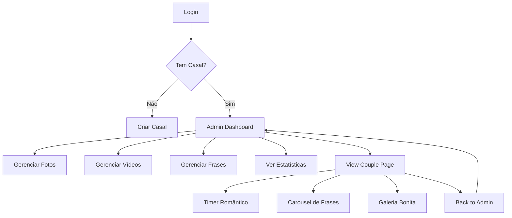

# 🔄 Admin vs View - Separação Completa

## ✨ **Nova Estrutura Implementada**

As páginas agora estão **completamente separadas**:

---

## 🛠️ **Admin Page (`/`) - Gerenciamento**

### Propósito:
- **Área de trabalho** para gerenciar conteúdo
- **Sem visualização bonita** (foco em funcionalidade)
- **Dashboard administrativo** com estatísticas

### Layout:

```
┌─────────────────────────────────────────────┐
│  Couple Moments - Admin                     │
│  [View Couple Page] [Email] [Logout]        │
├─────────────────────────────────────────────┤
│                                             │
│  ╔═══════════════════════════════════════╗  │
│  ║   📊 Admin Dashboard                  ║  │
│  ║   ─────────────────────────────────   ║  │
│  ║   Bia & Herver                        ║  │
│  ║   Manage your couple's content        ║  │
│  ║                                       ║  │
│  ║   Photos: 5 | Videos: 3 | Started    ║  │
│  ╚═══════════════════════════════════════╝  │
│                                             │
│  ┌───────────────────────────────────────┐  │
│  │ 📸 Photo Gallery                      │  │
│  │ [Upload Photo]                        │  │
│  │ ┌───┐ ┌───┐ ┌───┐                    │  │
│  │ │IMG│ │IMG│ │IMG│ [🗑️]               │  │
│  │ └───┘ └───┘ └───┘                    │  │
│  └───────────────────────────────────────┘  │
│                                             │
│  ┌───────────────────────────────────────┐  │
│  │ 🎵 YouTube Gallery                    │  │
│  │ [Add Video]                           │  │
│  │ ┌─────┐ ┌─────┐                       │  │
│  │ │VIDEO│ │VIDEO│ [🗑️]                  │  │
│  │ └─────┘ └─────┘                       │  │
│  └───────────────────────────────────────┘  │
│                                             │
│  ┌───────────────────────────────────────┐  │
│  │ 💕 Romantic Phrases                   │  │
│  │ [Add Phrase]                          │  │
│  │ "Frase romântica..."                  │  │
│  └───────────────────────────────────────┘  │
│                                             │
└─────────────────────────────────────────────┘
```

### Características:
- ✅ **Dashboard Card** com estatísticas
- ✅ **Seções em cards brancos** separados
- ✅ **Botões de gerenciamento** visíveis
- ✅ **Sem timer** (não é necessário aqui)
- ✅ **Sem carousel de frases** (só gerenciamento)
- ✅ **Layout funcional** e direto

---

## 💕 **Couple Page (`/couple`) - Visualização**

### Propósito:
- **Página bonita** para visualizar
- **Experiência romântica** e emocional
- **Read-only** (sem botões de edição)

### Layout:

```
┌─────────────────────────────────────────────┐
│  ❤️ Bia & Herver                            │
│  [← Back to Admin] [Email] [Logout]         │
├─────────────────────────────────────────────┤
│                                             │
│           Bia & Herver                      │
│    Your private space to celebrate 💕       │
│                                             │
│  ╔═══════════════════════════════════════╗  │
│  ║    ❤️ Our Journey Together            ║  │
│  ║                                       ║  │
│  ║   490 Days | 17 Hours | 09 Minutes   ║  │
│  ║   Started: August 24, 2024           ║  │
│  ╚═══════════════════════════════════════╝  │
│                                             │
│  ╔═══════════════════════════════════════╗  │
│  ║   💕 Romantic Phrases                 ║  │
│  ║   "You are my favorite hello..."      ║  │
│  ║   [Copy] [Next]                       ║  │
│  ╚═══════════════════════════════════════╝  │
│                                             │
│  ┌─────────────────────────────────────┐    │
│  │ 📸 Photo Gallery                    │    │
│  │                                     │    │
│  │ ┌──────┐ ┌──────┐ ┌──────┐        │    │
│  │ │ FOTO │ │ FOTO │ │ FOTO │        │    │
│  │ │      │ │      │ │      │        │    │
│  │ │Caption│ │Caption│ │Caption│      │    │
│  │ │Date  │ │Date  │ │Date  │        │    │
│  │ └──────┘ └──────┘ └──────┘        │    │
│  └─────────────────────────────────────┘    │
│                                             │
│  ┌─────────────────────────────────────┐    │
│  │ 🎵 Our Playlist                     │    │
│  │                                     │    │
│  │ ┌──────┐ ┌──────┐                 │    │
│  │ │VIDEO │ │VIDEO │                 │    │
│  │ │Title │ │Title │                 │    │
│  │ │Date  │ │Date  │                 │    │
│  │ └──────┘ └──────┘                 │    │
│  └─────────────────────────────────────┘    │
│                                             │
└─────────────────────────────────────────────┘
```

### Características:
- ✅ **Timer romântico** rodando em tempo real
- ✅ **Carousel de frases** interativo
- ✅ **Galerias estilizadas** com legendas
- ✅ **Sem botões de edição**
- ✅ **Layout bonito** e emocionante
- ✅ **Gradientes e bordas rosa**

---

## 📊 **Comparação Lado a Lado**

| Aspecto | Admin (`/`) | Couple Page (`/couple`) |
|---------|-------------|-------------------------|
| **Título** | "Couple Moments - Admin" | Nome do casal |
| **Header Button** | "View Couple Page" | "Back to Admin" |
| **Dashboard** | ✅ Card com estatísticas | ❌ Não tem |
| **Timer** | ❌ Não exibe | ✅ Grande e animado |
| **Frases** | Gerenciamento apenas | ✅ Carousel interativo |
| **Fotos** | Lista com [Upload] [Delete] | ✅ Cards estilizados |
| **Vídeos** | Lista com [Add] [Delete] | ✅ Cards estilizados |
| **Layout** | Cards brancos funcionais | Gradientes românticos |
| **Propósito** | Trabalho/Gerenciamento | Visualização/Apresentação |

---

## 🎯 **Casos de Uso**

### **1. Preparação de Conteúdo (Admin):**
```
1. Login → Admin Page
2. Dashboard mostra: "5 fotos, 3 vídeos"
3. Upload nova foto → Estatística atualiza
4. Add novo vídeo → Estatística atualiza
5. Add frase personalizada
```

### **2. Visualização Romântica (Couple):**
```
1. Admin → Click "View Couple Page"
2. Tela bonita com timer rodando
3. Frases românticas em carousel
4. Galerias estilizadas
5. Perfeito para mostrar para o parceiro!
```

### **3. Apresentação em Evento:**
```
1. Prepare tudo no Admin
2. Abra /couple em TV/Projetor
3. Modo fullscreen
4. Timer impressiona os convidados
5. Galeria roda automaticamente
```

---

## 🎨 **Diferenças Visuais**

### **Admin Page (`/`):**
```css
✅ Background branco/cinza claro
✅ Cards com border simples
✅ Botões de ação visíveis
✅ Layout em grid simples
✅ Foco em funcionalidade
✅ Dashboard com números
```

### **Couple Page (`/couple`):**
```css
✅ Background gradiente rosa
✅ Cards com sombras e bordas românticas
✅ Sem botões de edição
✅ Layout espaçoso e bonito
✅ Foco na experiência
✅ Animações suaves
```

---

## 🚀 **Fluxo de Trabalho Completo**



---

## ✅ **Funcionalidades por Página**

### **Admin (`/`):**
- [x] Dashboard com estatísticas (fotos, vídeos, data início)
- [x] Seção de gerenciamento de fotos
  - Upload com preview
  - Lista de fotos com delete
  - Caption para cada foto
- [x] Seção de gerenciamento de vídeos
  - Add com URL
  - Lista de vídeos com delete
  - Título para cada vídeo
- [x] Seção de gerenciamento de frases
  - Add frase customizada
  - Escolher categoria
  - Adicionar autor
- [x] Botão "View Couple Page"
- [x] Layout funcional e direto

### **Couple Page (`/couple`):**
- [x] Timer do relacionamento (dias, horas, minutos, segundos)
- [x] Carousel de frases românticas
  - Copy frase
  - Next frase
  - Filtro por categoria
- [x] Galeria de fotos estilizada
  - Cards com bordas
  - Legendas visíveis
  - Data formatada
  - Sem botões de edição
- [x] Galeria de vídeos estilizada
  - Player YouTube embutido
  - Títulos visíveis
  - Data formatada
  - Sem botões de edição
- [x] Botão "Back to Admin"
- [x] Layout romântico e bonito

---

## 📱 **Responsividade**

Ambas as páginas são responsivas:

```css
/* Mobile */
grid-cols-1        /* 1 coluna */

/* Tablet */
sm:grid-cols-2     /* 2 colunas */

/* Desktop */
lg:grid-cols-3     /* 3 colunas */
```

---

## 🎯 **Recomendações de Uso**

### **Para o Administrador:**
1. Use a **Admin Page** para todo o gerenciamento
2. Veja estatísticas rápidas no dashboard
3. Adicione conteúdo de forma organizada
4. Teste visualizando na Couple Page

### **Para Apresentar:**
1. Abra a **Couple Page** em fullscreen
2. Deixe o timer rodando
3. Navegue pelo carousel de frases
4. Mostre as galerias estilizadas
5. Sem distrações de botões de edição

### **Para Compartilhar:**
1. Compartilhe o link da **Couple Page**
2. Seu parceiro vê apenas a visualização bonita
3. Sem acesso a botões de edição
4. Experiência imersiva e romântica

---

## 🔐 **Segurança**

Ambas as páginas requerem autenticação:
- Se não autenticado: Redireciona para login
- Se autenticado mas sem casal: Redireciona para criar casal
- RLS do Supabase garante acesso apenas aos próprios dados

---

## 📈 **Melhorias Futuras Sugeridas**

### **Admin Page:**
- [ ] Gráfico de uploads ao longo do tempo
- [ ] Estatísticas avançadas (mais visualizada, etc)
- [ ] Bulk actions (deletar múltiplos)
- [ ] Reordenação drag & drop

### **Couple Page:**
- [ ] Modo apresentação automático (slideshow)
- [ ] Música de fundo
- [ ] Modo noturno automático
- [ ] Compartilhamento via QR Code
- [ ] Download da galeria completa

---

**🎉 Resultado: Duas páginas distintas e com propósitos claros!**
- **Admin:** Gerenciar conteúdo de forma eficiente
- **Couple:** Visualizar conteúdo de forma romântica

