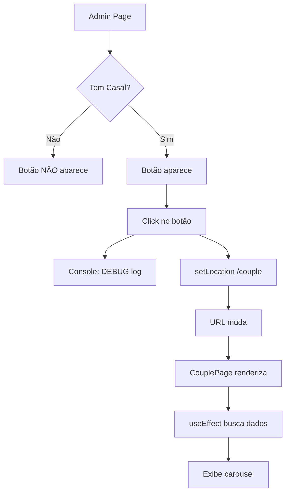

# 🔧 Troubleshooting - Botão "View Couple Page"

## 🎯 **Problema Relatado**

O botão "View Couple Page" não está navegando para `/couple` quando clicado.

---

## ✅ **Correções Aplicadas**

### 1. **Adicionado Debug Log:**
```typescript
onClick={() => {
  console.log("[DEBUG] Navigating to /couple");
  setLocation("/couple");
}}
```

### 2. **Botão Só Aparece Se Houver Casal:**
```typescript
{couple && (
  <Button onClick={() => setLocation("/couple")}>
    View Couple Page
  </Button>
)}
```

### 3. **Removidos Imports Desnecessários:**
Removidos `PhotoGallery` e `YoutubeGallery` do `CouplePage.tsx` pois não são mais usados.

---

## 🧪 **Como Testar**

### **1. Abra o Console do Navegador:**
```
F12 ou Cmd+Option+I
```

### **2. Acesse a Admin Page:**
```
http://localhost:3000/
```

### **3. Faça Login:**
- Digite email e senha
- Clique em "Sign In"

### **4. Verifique se o Botão Aparece:**
- ✅ O botão "View Couple Page" deve estar visível
- ❌ Se NÃO aparecer → Não há casal criado

### **5. Clique no Botão:**
- Observe o console → deve aparecer: `[DEBUG] Navigating to /couple`
- A URL deve mudar para: `http://localhost:3000/couple`
- A página deve carregar com o carousel de fotos

---

## 🔍 **Possíveis Problemas e Soluções**

### **Problema 1: Botão Não Aparece**
**Causa:** Não há casal criado no banco de dados.

**Solução:**
1. Clique em "Create Couple Profile"
2. Preencha os dados
3. Salve
4. O botão deve aparecer

---

### **Problema 2: Botão Aparece Mas Não Navega**
**Causa:** Erro no `wouter` ou conflito de rotas.

**Solução:**
1. Abra o console (F12)
2. Veja se há erros em vermelho
3. Procure por: `[DEBUG] Navigating to /couple`
4. Se aparecer mas não navegar → problema no `wouter`

**Fix:**
```bash
cd "/Volumes/HD Herver/Downloads/mymate/couple-moments"
pnpm install wouter@latest
```

---

### **Problema 3: Navega Mas Mostra Tela Branca**
**Causa:** Erro no `CouplePage.tsx`

**Solução:**
1. Abra o console (F12)
2. Veja o erro específico
3. Geralmente é:
   - Componente não encontrado
   - Hook usado incorretamente
   - Dados não carregados

**Debug:**
```typescript
// Adicione no topo do CouplePage.tsx
console.log("[CouplePage] Renderizando...");
console.log("[CouplePage] User:", user);
console.log("[CouplePage] Couple:", couple);
console.log("[CouplePage] Photos:", photos);
```

---

### **Problema 4: "Cannot read property 'length' of undefined"**
**Causa:** `photos` ou `videos` são `undefined` ao invés de `[]`

**Solução:**
Já foi corrigido! O código usa:
```typescript
const [photos, setPhotos] = useState<Photo[]>([]);  // ✅ Array vazio
const [videos, setVideos] = useState<Video[]>([]);  // ✅ Array vazio
```

---

## 📋 **Checklist de Verificação**

### **Admin Page (`/`):**
- [ ] Usuário está logado?
- [ ] Há um casal criado?
- [ ] O botão "View Couple Page" aparece?
- [ ] O botão está clicável (não disabled)?
- [ ] Ao clicar, o console mostra `[DEBUG] Navigating to /couple`?

### **Couple Page (`/couple`):**
- [ ] A URL muda para `/couple`?
- [ ] A página carrega (não fica em branco)?
- [ ] O timer aparece?
- [ ] O carousel de frases aparece?
- [ ] As fotos aparecem (se houver)?
- [ ] Os vídeos aparecem (se houver)?

---

## 🛠️ **Comandos de Debug**

### **1. Verificar Rota Registrada:**
```bash
cd "/Volumes/HD Herver/Downloads/mymate/couple-moments"
grep -n "Route.*couple" client/src/App.tsx
```

**Output esperado:**
```
17:      <Route path={"/couple"} component={CouplePage} />
```

### **2. Verificar Importação:**
```bash
grep -n "import.*CouplePage" client/src/App.tsx
```

**Output esperado:**
```
9:import CouplePage from "./pages/CouplePage";
```

### **3. Verificar Se Arquivo Existe:**
```bash
ls -la client/src/pages/CouplePage.tsx
```

**Output esperado:**
```
-rw-r--r--  1 user  staff  15234 Dec 28 14:18 client/src/pages/CouplePage.tsx
```

---

## 🔄 **Teste Manual Completo**

### **1. Limpe o Cache:**
```
Ctrl+Shift+R (Chrome/Edge)
Cmd+Shift+R (Mac)
```

### **2. Abra o DevTools:**
```
F12 → Console
```

### **3. Teste o Fluxo:**
```
1. Login → Admin Page
2. Veja o botão "View Couple Page"
3. Abra Network tab (F12)
4. Clique no botão
5. Verifique:
   - Console: [DEBUG] Navigating to /couple
   - Network: Nenhuma requisição 404
   - URL: http://localhost:3000/couple
   - Página: Carousel aparece
```

---

## 🚨 **Erros Comuns**

### **1. "Cannot read property 'map' of undefined"**
```typescript
// Antes (ERRADO):
{photos.map(...)}  // ❌ Se photos for undefined

// Depois (CORRETO):
{photos.length > 0 && photos.map(...)}  // ✅ Verifica antes
```

### **2. "useEffect dependency warning"**
```typescript
// Adicione todas as dependências:
useEffect(() => {
  // ...
}, [user, isAuthenticated, setLocation, fetchPhotos, fetchVideos]);
```

### **3. "Can't perform a React state update on an unmounted component"**
```typescript
// Adicione cleanup:
useEffect(() => {
  let mounted = true;
  
  const fetchData = async () => {
    if (mounted) {
      // fetch...
    }
  };
  
  fetchData();
  return () => { mounted = false; };
}, []);
```

---

## 📊 **Fluxo Esperado**



---

## ✅ **Solução Rápida**

Se nada funcionar, tente:

```bash
# 1. Mate o servidor
Ctrl+C

# 2. Limpe node_modules
cd "/Volumes/HD Herver/Downloads/mymate/couple-moments"
rm -rf node_modules .vite

# 3. Reinstale
pnpm install

# 4. Reinicie
pnpm dev
```

---

## 📞 **Informações de Debug**

Ao relatar um problema, forneça:

1. **Console Errors:**
```
Copie TODOS os erros em vermelho do console
```

2. **Network Tab:**
```
Veja se há requisições 404 ou 500
```

3. **React DevTools:**
```
Verifique se CouplePage está na árvore de componentes
```

4. **Estado:**
```typescript
console.log({
  isAuthenticated,
  user,
  couple,
  coupleId,
  photos,
  videos
});
```

---

## 🎯 **Teste Final**

1. ✅ Login funciona?
2. ✅ Dashboard aparece?
3. ✅ Botão "View Couple Page" visível?
4. ✅ Ao clicar → URL muda?
5. ✅ Página `/couple` carrega?
6. ✅ Carousel aparece?
7. ✅ Timer roda?
8. ✅ Botão "Back to Admin" funciona?

---

**Se TODOS os ✅ estão marcados → ESTÁ FUNCIONANDO! 🎉**

**Se algum ❌ → Veja a seção de problemas acima.**

